# Aegis — Diagramas do Sistema

Documento visual de toda a aplicação. Diagramas em **Mermaid** (renderizam direto no
GitHub, no preview do VS Code e em qualquer visualizador Markdown moderno).

> Aegis = camada de **execução privada** para multisigs Squads v4. Membros
> aprovam um envio on-chain → o gatekeeper emite uma **licença** com hash do payload
> → o **operador** consome a licença e executa o depósito privado no Cloak.

---

## 1. Visão geral — quem fala com quem

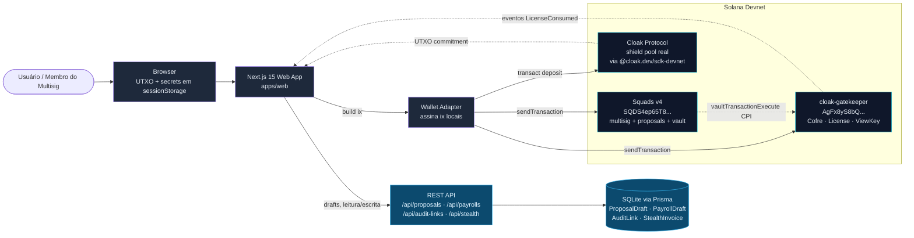

**Pontos-chave:**

- Tudo que é segredo (note keypair, blinding, viewing key) **fica no browser** (sessionStorage). Server só guarda metadado público.
- O gatekeeper é uma **state machine pura** — não faz CPI no Cloak. Quem chama o `transact()` é o operador, em transação separada.
- A vault PDA do Squads é o "inner signer" no `issue_license`: é assim que o gatekeeper sabe que o pedido veio de um vault legítimo.

---

## 2. Componentes on-chain (3 programas, 2 contas)

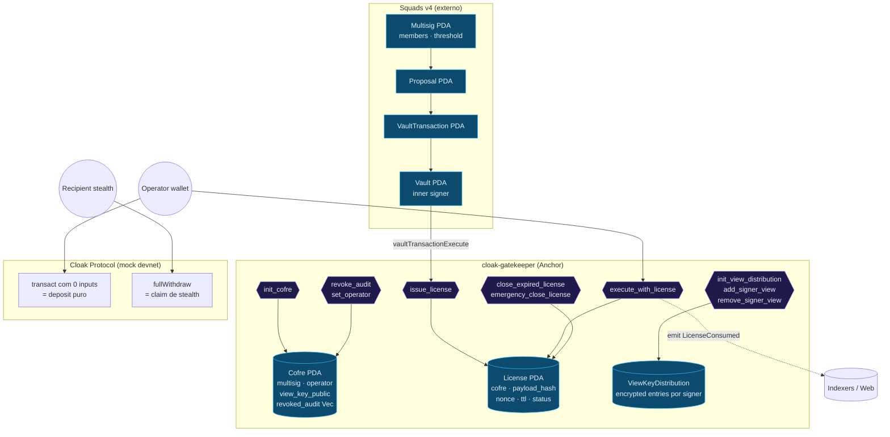

| Conta | Vive em | O que guarda |
|-------|---------|--------------|
| `Cofre` | gatekeeper | 1 por multisig — operator atual, view key pública, lista de diversifiers revogados |
| `License` | gatekeeper | 1 por execução — `payload_hash`, `nonce`, `expires_at`, `status` (Active/Consumed) |
| `ViewKeyDistribution` | gatekeeper | distribuição da view key cifrada por signer (NaCl box) |
| `Multisig`/`Proposal`/`VaultTransaction` | Squads v4 | governança + voting + execução do bundle |

---

## 3. Mapa do frontend (rotas + componentes)

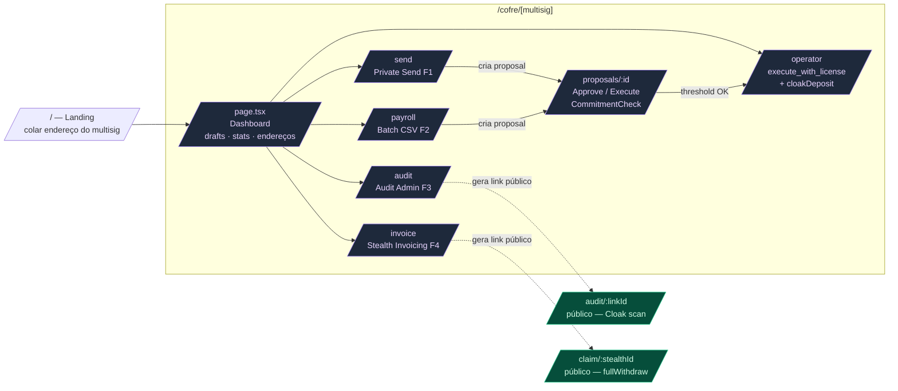

**API REST (server, Next.js route handlers)**

```
/api/proposals               POST  · GET (lista por multisig)
/api/proposals/:multisig
/api/proposals/:multisig/:index   GET single

/api/payrolls                POST · GET lista
/api/payrolls/:multisig/:index    GET single

/api/audit-links             POST
/api/audit-links/:cofre      GET lista
/api/audit/:linkId           GET público (revelação)
/api/audit/:linkId/revoke    POST

/api/stealth                 POST · GET lista
/api/stealth/:id             GET single
/api/stealth/:id/utxo        PATCH (operator grava UTXO p/ claim)
/api/stealth/:id/claim       POST (recipient marca como claimed)
```

---

## 4. Feature F1 — Private Send (fluxo completo)

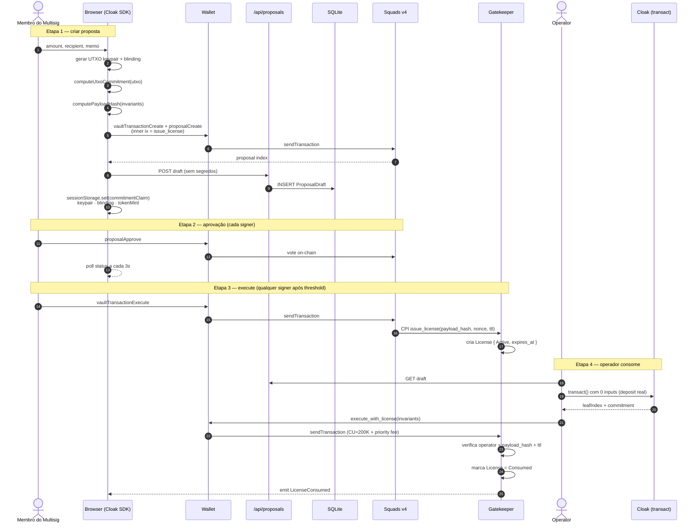

**Invariantes que entram no `payload_hash`** (SHA-256, com domain separator):
`token_mint · amount · recipient · cofre · expires_at · nonce`. Trocar 1 byte
quebra o execute — é o que impede o operador de "redirecionar" o envio.

---

## 5. Feature F2 — Payroll em batch (CSV)

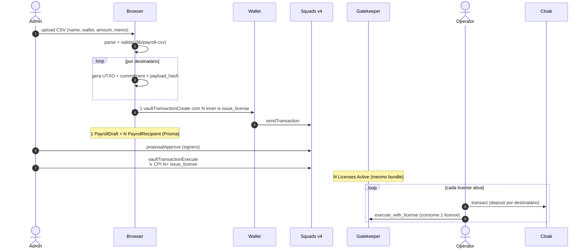

**Por que tudo em uma proposal?** Aprovação atômica. Os signers aprovam o lote
inteiro de payroll. Se algum invariante falhar, nenhuma licença é emitida.

---

## 6. Feature F3 — Audit Admin (revelação seletiva)

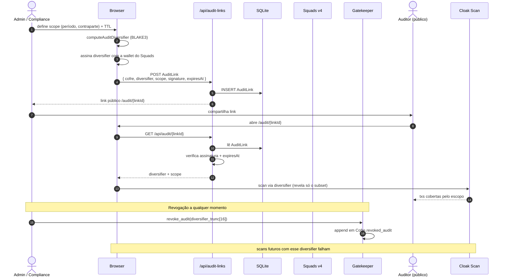

**Importante:** o link é público mas **só revela o que estava no escopo assinado**.
Sem assinatura válida ou se o diversifier estiver na lista revogada do `Cofre`,
o scan retorna vazio. Isso é o "view key seletivo" do Cloak.

---

## 7. Feature F4 — Stealth Invoicing + Claim

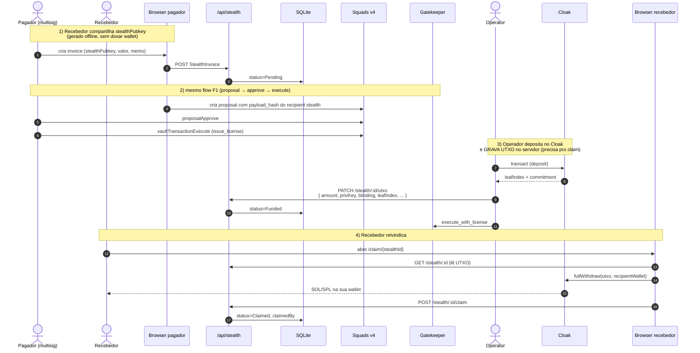

**Por que UTXO fica no server (e não em sessionStorage)?** O recebedor não tem
sessão prévia. Ele precisa abrir o link e claim. As chaves do UTXO **não**
expõem o multisig — só permitem retirar aquele depósito específico para a
wallet do recebedor.

---

## 8. Máquina de estados — License

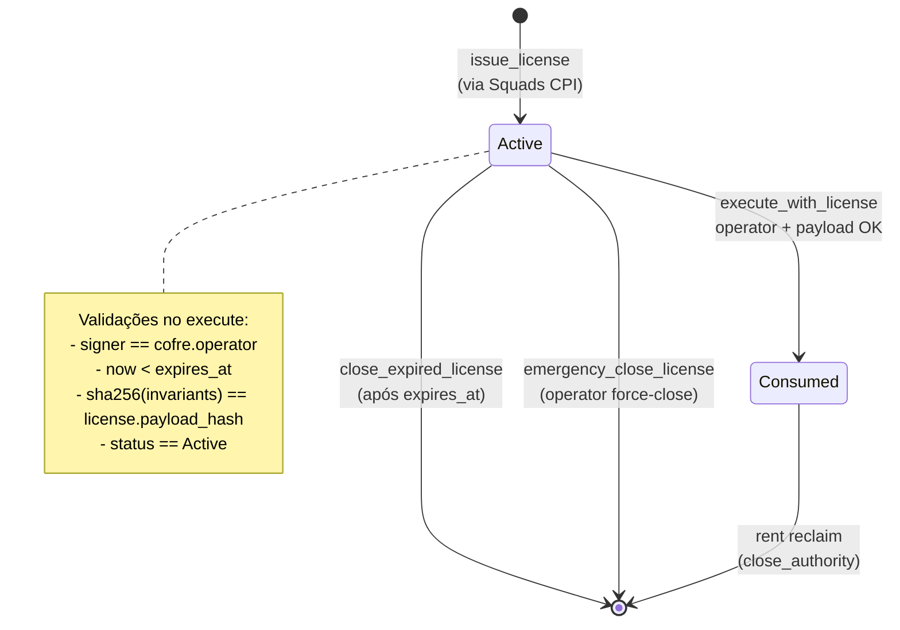

**Equivalente para Proposal (Squads v4)** — fora do nosso programa, mas é o gate
anterior:

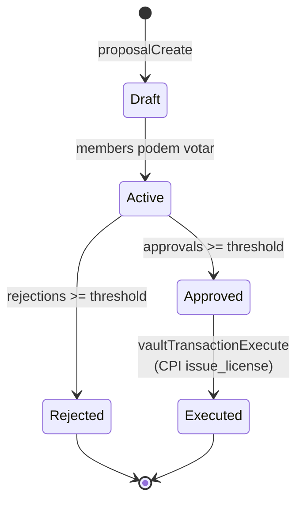

---

## 9. Modelo de dados (Prisma · SQLite)

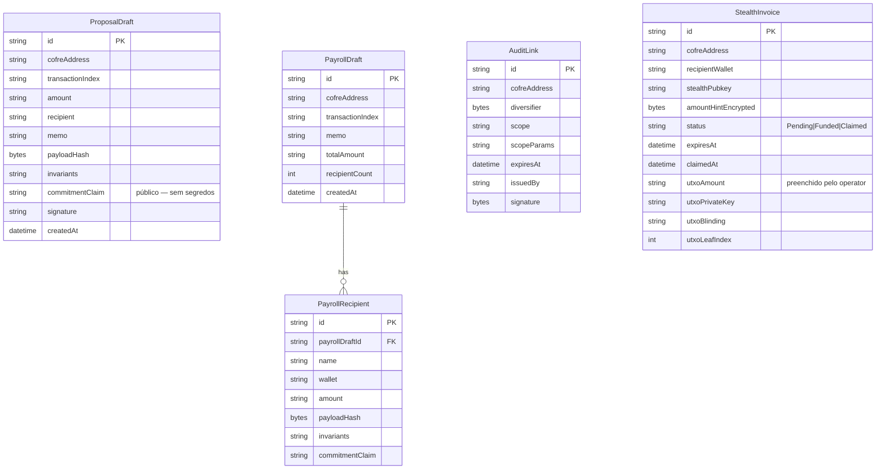

**Regra de ouro de segurança no DB:**
- `commitmentClaim` é **público** (commitment já vai on-chain).
- **Segredos do UTXO de drafts/payroll** ficam em `sessionStorage` do criador.
- **Segredos do UTXO de stealth invoice** ficam no DB porque o recebedor precisa lê-los para fazer claim — mas só revelam aquele depósito específico.

---

## 10. Tela por feature (resumo de produto)

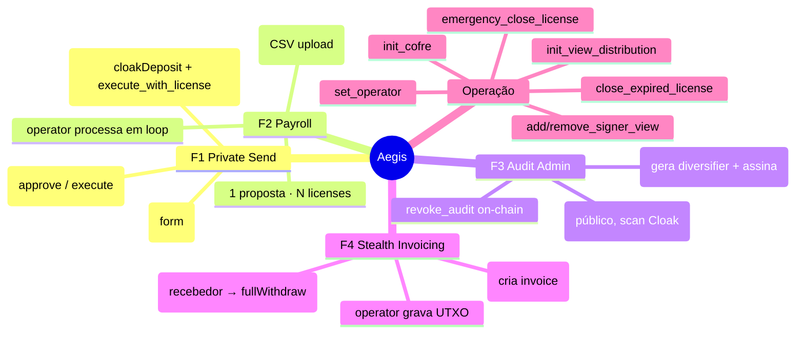

---

## 11. Pacote compartilhado `@cloak-squads/core`

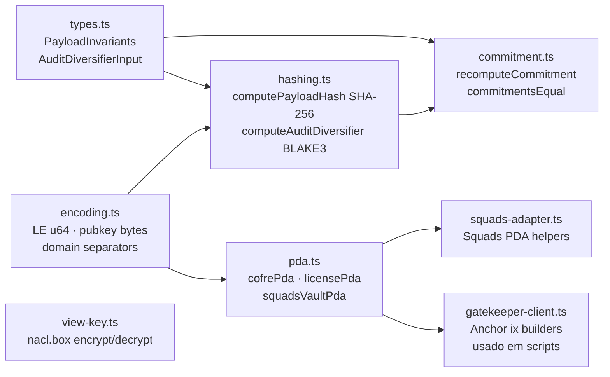

O **frontend NÃO usa** `gatekeeper-client.ts` (Anchor) — usa
`apps/web/lib/gatekeeper-instructions.ts` que serializa as ix manualmente.
Razão: evitar bundle do Anchor no cliente e ter controle fino sobre layout
das contas. Os scripts de devnet/CI continuam usando o builder Anchor.

---

## 12. Ambientes & artefatos

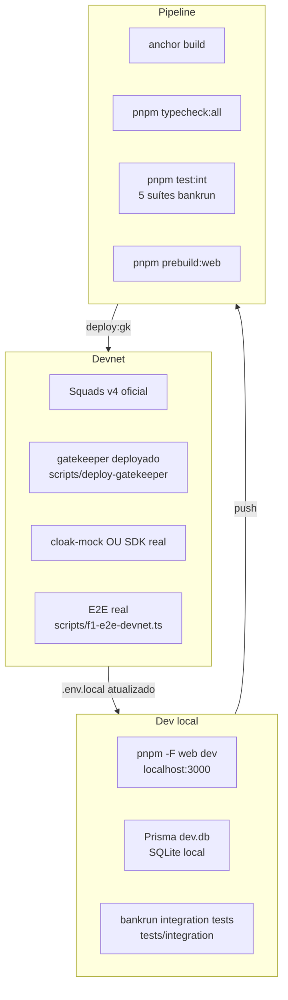

---

## Como ler este documento

1. **Quer entender o produto?** → Comece em §1 (visão geral) e §10 (mindmap de features).
2. **Quer entender o que acontece quando aperto "Send"?** → §4 (sequência F1).
3. **Vai mexer no programa Anchor?** → §2 (componentes on-chain) + §8 (state machine).
4. **Vai mexer no DB ou API?** → §9 (ER) + §3 (rotas).
5. **Vai trabalhar no shared core?** → §11.

Para detalhes textuais complementares: [`docs/ARCHITECTURE.md`](ARCHITECTURE.md),
[`docs/SECURITY.md`](SECURITY.md), [`docs/DEMO.md`](DEMO.md).
